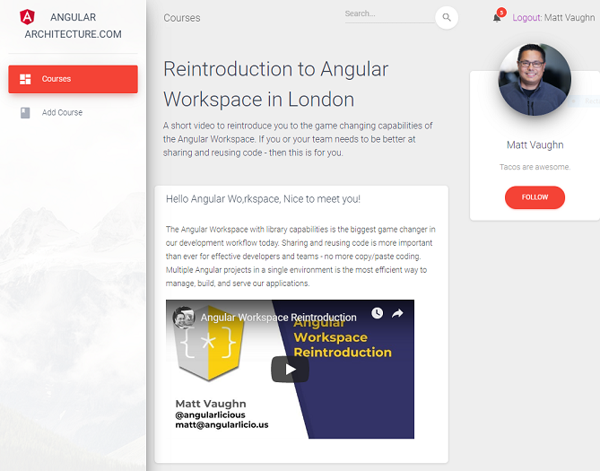

# Angular Architecture

This is the code repository for the Angular Architecture book available on [Leanpub.com](https://leanpub.com/angular-architecture-the-unofficial-guide). The reference application is contained in the _workspace_ folder. It is an Angular Workspace - a monorepo with a single web application project and several library projects.

This book provides the missing guidance to build enterprise-level Angular applications that impress. Simplify your code and focus on what matters by leveraging specific architectural patterns, designs, and principles. This book provides the motivation and actual code and a working application that demonstrates clean architecture for an Angular application.



## Getting Started

The application uses Firebase/Firestore for the application database and to manage user authentication. You will need to have a Firebase account to setup the database.

There are (3) modules where you need to update the `firebaseOptions` with your actual Firebase API Key and information.

```ts
const firebaseOptions = {
  apiKey: "YOUR-GOOGLE-API-KEY-HERE",
  authDomain: "AUTH-DOMAIN-HERE",
  databaseURL: "FIREBASE-DATABASE-URL",
  projectId: "FIREBASE-PROJECT-ID-HERE",
  storageBucket: "FIREBASE-STORAGE-BUCKET",
  messagingSenderId: ""
};
```

- libs\lms\business\authors\src\lib\lms-business-authors.module.ts
- libs\lms\business\courses\src\lib\lms-business-courses.module.ts
- libs\security\src\lib\security.module.ts

> Note: the reference app will be updated to _seed_ the database with sample data.
